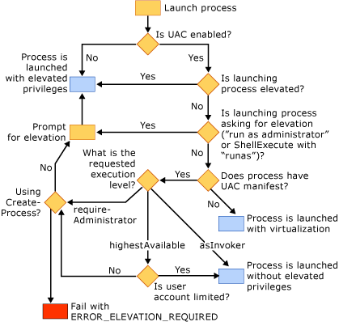

# Reference Test

interl link
  
-   [refer](refer.md)  
  
image link
  

externnal link  
For more information, see the StackOverflow article [what C++ idioms are deprecated in C++11](http://go.microsoft.com/fwlink/?LinkId=402836)  
   
 
## In This Section  

  
## Related Sections  

  
## See Also  
 [refer Reference](refer.md)
